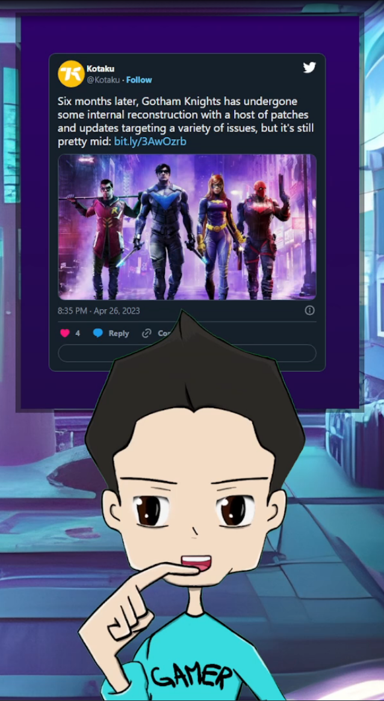

# AI Content Creator

AI Content Creator is a Web APP that makes interaction of OpenAI's GPT model and content creation easy.

## Features

- Direct communication with the model
  - [SpeechRecognition](https://developer.mozilla.org/en-US/docs/Web/API/SpeechRecognition) is used so you can talk to your AI Content Creator.
- Prompt Queue System queues all the prompts for interaction and moderation.
  - Prompts Queue processing can be started/stopped.
  - Prompts can be further eddited before being processed.
- **React section** allows your AI Content Creator to react to content
  - AI Content Creator can interract with Tweets, Reddit posts, Youtube comments, or any text you give it.
- Twitch chat integration
  - The APP is conntected to Twitch chat, so your AI can interract with your viewers.

## Pre-requirements

There are a couple of `env` variables you need to set before using the app:

- **SUPABASE_URL**: this is where model's "context" (SYSTEM messages) are kept
- **SUPABASE_SERVICE_ROLE_KEY**: this is where model's "context" (SYSTEM messages) are kept
- **TWITTER_TOKEN**: so the APP can fetch Tweets and embedd them
- **TWITTER_APP_KEY**: so the APP can fetch Tweets and embedd them
- **TWITTER_APP_KEY_SECRET**: so the APP can fetch Tweets and embedd them
- **TWITTER_ACCESS_TOKEN**: so the APP can fetch Tweets and embedd them
- **TWITTER_ACCESS_TOKEN_SECRET**: so the APP can fetch Tweets and embedd them
- **TWITCH_CLIENT_ID**: required for NextAuth login with Twtich
- **TWITCH_CLIENT_SECRET**: required for NextAuth login with Twtich
- **NEXT_PUBLIC_TWITCH_USERNAME**: so the APP can access Twitch chat
- **NEXT_PUBLIC_TWITCH_PASSWORD**: so the APP can access Twitch chat
- **OPENAI_API_KEY**: OpenAI API key so the APP can use the model
- **GOOGLE_CLIENT_EMAIL**: required for Text-To-Speech
- **GOOGLE_PRIVATE_KEY**: required for Text-To-Speech

 
 

  

